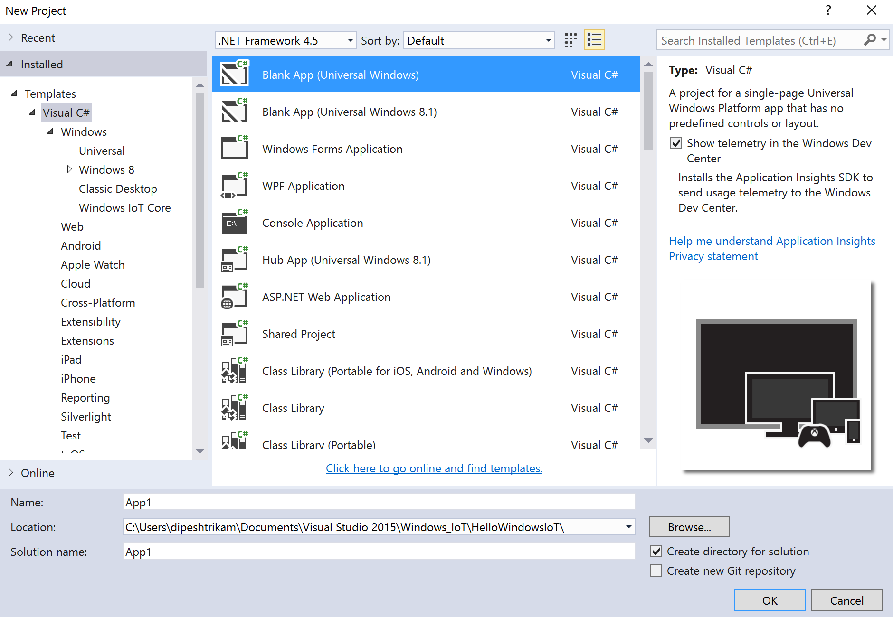
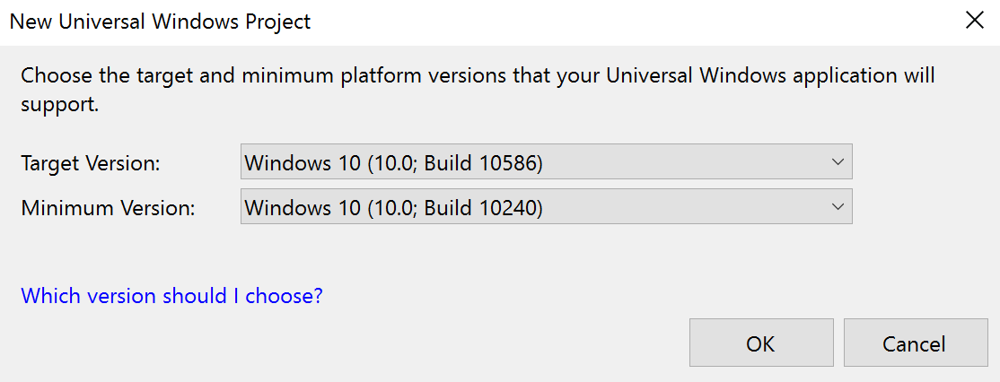
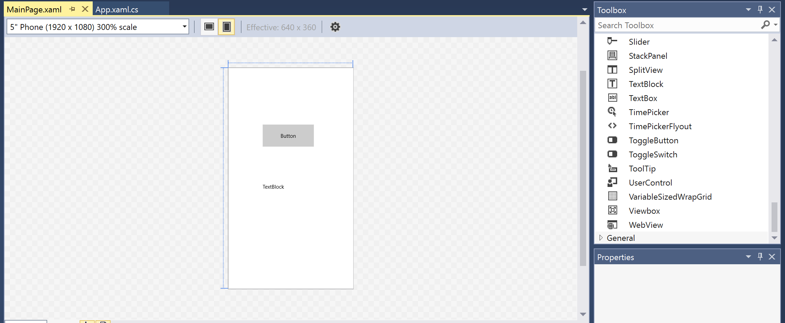
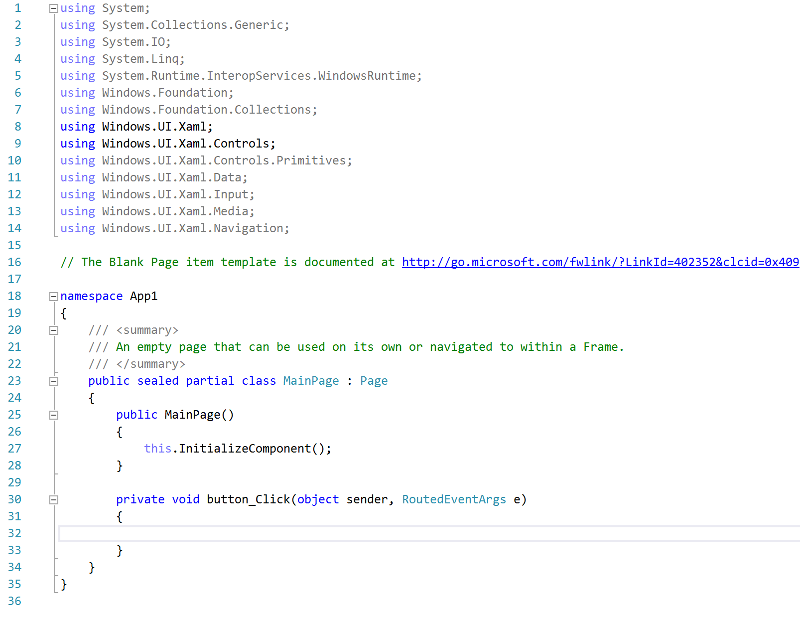
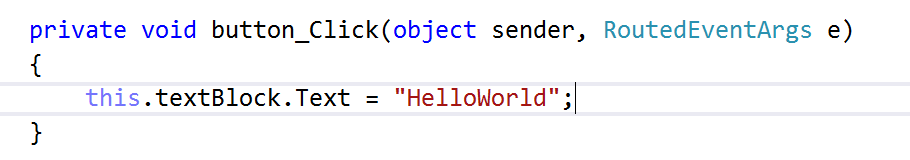
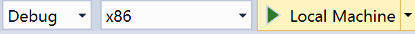
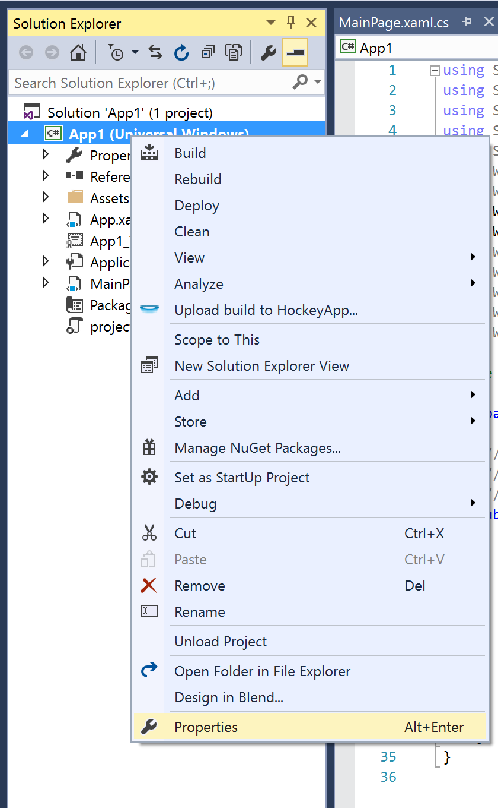
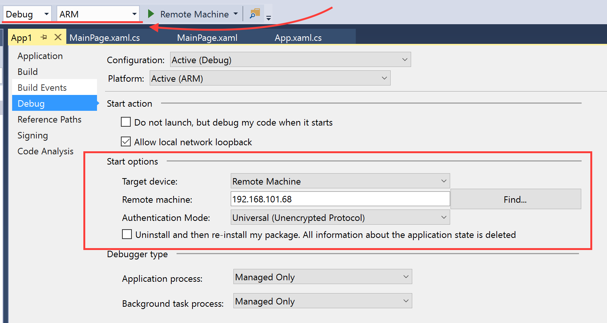

# IoT Azure Functions HoLs

# Getting started

## 1. Lets Begin
  * Open Microsoft Visual Studio
  * Create a **New Project** 
  * Choose Visual C# 
  * Select Blank App (Universal Windows App)
  * Fill out the relevent information about the app name and location 
  * Click **OK**



## 2. Click **OK** as below



## 3. Open the MainPage.xaml file by double clicking it
  * This file can be found in the solution explorer

## 4. Drag a TextBlock and Button into your blank canvas 



## 5. Double Click your button, this will open a MainPage.xaml.cs file 



## 6. Type the following into your button_Click method

```csharp
 this.textBlock.Text = "HelloWorld";
 ```



## 7. The last step is to deploy the app as seen below 



#### You have successfully deployed an app to your local machine, we will now deploy it onto a Raspberry Pi

## 1. To deploy to a remote machine what we will do is right click your app in the solution explorer and click properties as seen below



## 2. Click Debug in the side menu and change the settings such that they match the picture below (IP Address will be on your Monitor)



## 3. You are now ready to deploy the same Universal Windows Platform App to your Raspberry Pi
  * Use your keyboard and mouse on your raspberry pi to navigate your app as you did on your local machine

#### You have successfully deployed an app to your remote machine