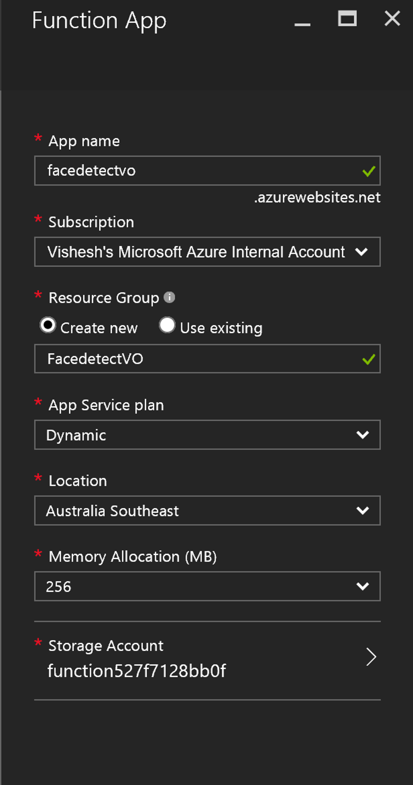
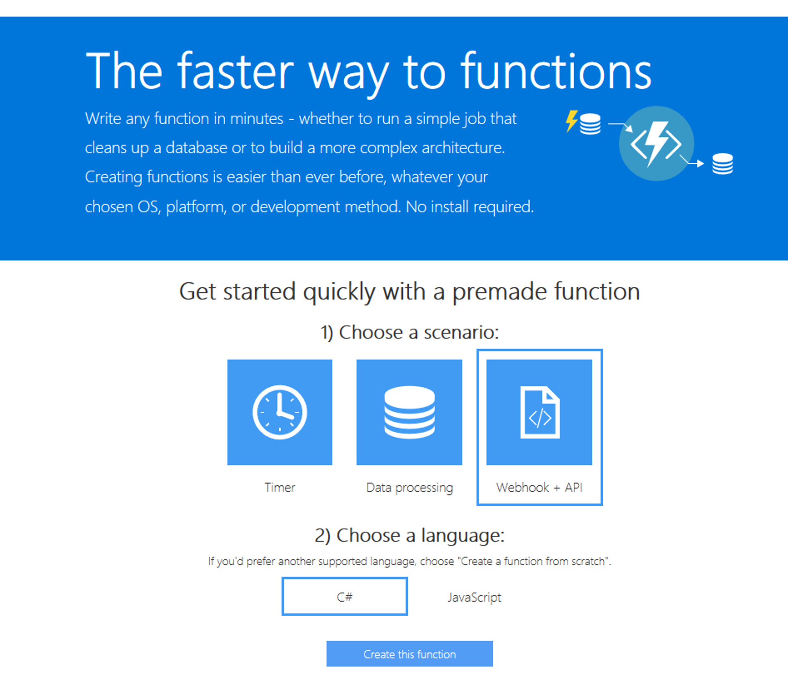
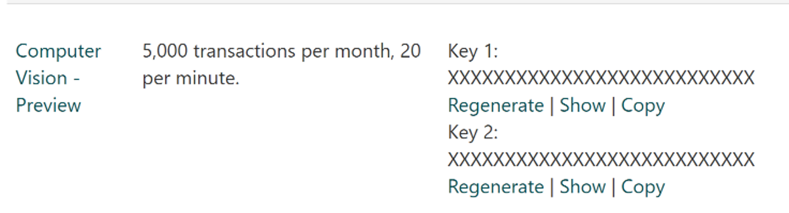
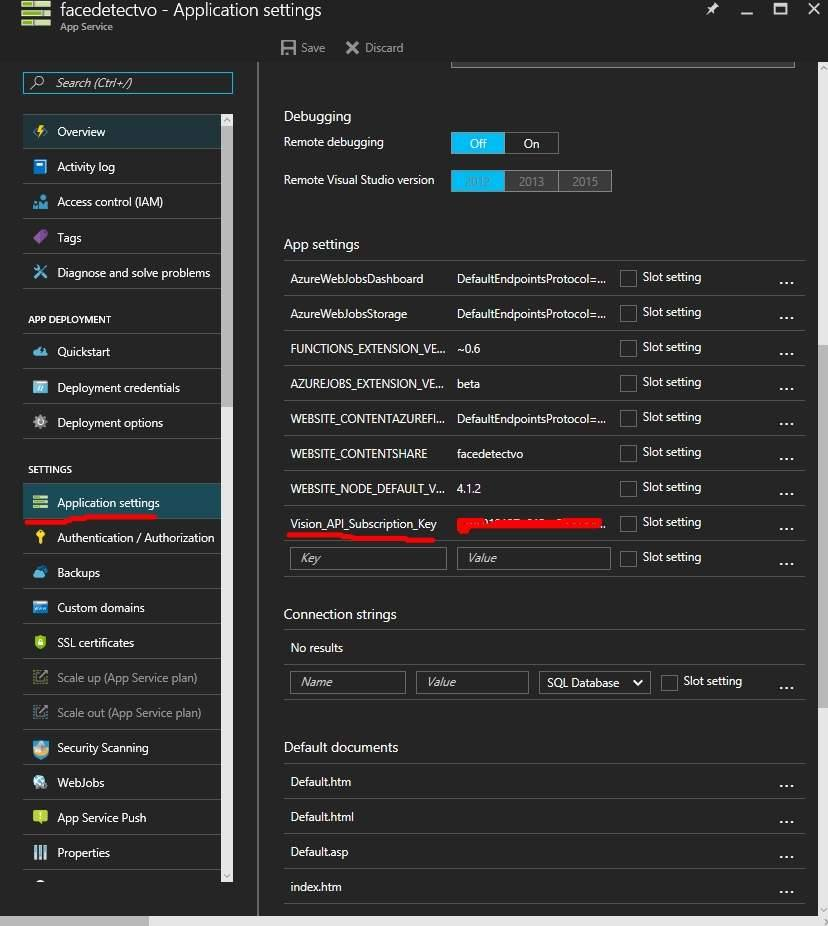

# IoT Azure Functions HoLs

## Introduction

### Welcome to the Hands on Lab at Microsoft Ignite 2016.

#### What is IoT? 

The Internet of Things (IoT) refers to the ever-growing network of physical objects that feature an IP address for internet connectivity, and the communication that occurs between these objects and other Internet-enabled devices and systems.

The Internet of Things extends internet connectivity beyond traditional devices like desktop and laptop computers, smartphones and tablets to a diverse range of devices and everyday things that utilise embedded technology to communicate and interact with the external environment, all via the Internet.

### What will we be doing today?

 1. You will build a Windows 10 Application and deploy it to a Raspberry Pi 3, this application will automatically capture a picture of faces
 2. This image will be sent to your Azure Function 
 3. The Azure Function App will use Microsoft Cognitive Services **Vision API** which will analyse the picture and return a response 
 4. This response will be an image that would have detected one or more human faces in your image with face rectangles for where in the image the faces are, along with face attributes which contain machine learning-based predictions of facial features. After detecting faces, you can take the face rectangle and pass it to the Emotion API to speed up processing. The face attribute features available are: Age, Gender, Pose, Smile, and Facial Hair along with 27 landmarks for each face in the image. 
 
### Extra for experts 
 * We will be using the Vision API to detect faces, but the face API can also be used to expand this application to easily find similar-looking faces.
   * Given a collection of faces and a new face as a query, this API will return a collection of similar faces.

### What is Microsoft Cognitive Services?

Microsoft Cognitive Services let you build apps with powerful algorithms using just a few lines of code. They work across devices and platforms such as iOS, Android, and Windows, keep improving, and are easy to set up. 


## Learning Outcomes
* Learn to build Windows 10 Application and deploy it to a Raspberry Pi 3 
* Learn the basics of IoT (Internet of Things)
* Learn about Microsoft Cognitive services

### Tools
* [Visual Studio Code](https://code.visualstudio.com)
* [Azure Portal](portal.azure.com) 

### Extra Resources
* [Microsoft Cognitive services](https://azure.microsoft.com/en-in/documentation/articles/app-service-web-overview/)
* [Windows 10 IoT core](https://developer.microsoft.com/en-us/windows/iot/explore/iotcore)
* [Microsoft IoT](http://www.microsoft.com/en-us/cloud-platform/internet-of-things)

### You have been given a:
* Raspberry Pi 3 with Windows 10 IoT core pre-installed
* Microsoft LifeCam HD-3000 Webcam
* Keyboard
* Mouse

# Getting started

## 1. Lets Begin
  * Go to [portal.azure.com](https://portal.azure.com)
  * Log in with the azure credentials 

## 2. Creating an Azure Funtion 
  * Click on "New" in the top left corner of the portals home page
  * Click on "New" under the Market Place heading
  * Select "Virtual Machines"
  * Select "Function App"

## 3. Enter Details
  * Fill out the information about your Function App 
    - Note you should get a tick next to your **App name**
    - Try and add unique details, by adding your initials or name at the end of the app
  * For the "Resource Group", **Create** new Resource Group
  * Select any **Location**
  * Memory Allocation (MB) should be **256MB**
  * Click on **Create** at the bottom  



## 4. Azure is now deploying the Function App
    * Once done, create a new function with an **HTTP Trigger and C#**, like below:




## 5. Replace and Paste this code:

```csharp
#r "Microsoft.WindowsAzure.Storage"
#r "Newtonsoft.Json"
#r "System.Drawing"
 
using System.Net;
using System.Net.Http;
using System.Net.Http.Headers;
using Newtonsoft.Json;
using Microsoft.WindowsAzure.Storage.Table;
using System.IO; 
using System.Drawing;
using System.Drawing.Imaging;
using System;
using System.Collections.Generic;
using System.Threading.Tasks;

 
public static async Task<HttpResponseMessage> Run(HttpRequestMessage req, TraceWriter log)
{
    var image = await req.Content.ReadAsStreamAsync();
    log.Info(Environment.GetEnvironmentVariable("Vision_API_Subscription_Key"));
    MemoryStream mem = new MemoryStream();
    image.CopyTo(mem); //make a copy since one gets destroy in the other API. Lame, I know.
    image.Position = 0;
    mem.Position = 0;
    log.Info("hello"); 
    string result = await CallVisionAPI(log, image); 
    log.Info(result); 

    VisionObject v = JsonConvert.DeserializeObject<VisionObject>(result);
    log.Info(v.description.captions[0].text);
    if (String.IsNullOrEmpty(result)) {
        return req.CreateResponse(HttpStatusCode.BadRequest);
    }
     
    ImageData imageData = JsonConvert.DeserializeObject<ImageData>(result);
 
    MemoryStream outputStream = new MemoryStream();
    using(Image maybeFace = Image.FromStream(mem, true))
    {
        using (Graphics g = Graphics.FromImage(maybeFace))
        {
            Pen yellowPen = new Pen(Color.Yellow, 4);
            foreach (Face face in imageData.Faces)
            {
                var faceRectangle = face.FaceRectangle;
                g.DrawRectangle(yellowPen, 
                    faceRectangle.Left, faceRectangle.Top, 
                    faceRectangle.Width, faceRectangle.Height);
            }
        }
        maybeFace.Save(outputStream, ImageFormat.Jpeg);
    }
     
    var response = new HttpResponseMessage()
    {
        Content = new ByteArrayContent(outputStream.ToArray()),
        StatusCode = HttpStatusCode.OK,
    };
    response.Content.Headers.ContentType = new MediaTypeHeaderValue("image/jpeg");
    return response;
}
 
static async Task<string> CallVisionAPI(TraceWriter log, Stream image)
{
    using (var client = new HttpClient())
    {
        var content = new StreamContent(image);
log.Info("1");
        var url = "https://api.projectoxford.ai/vision/v1.0/analyze?visualFeatures=Tags,Description,Faces";
        client.DefaultRequestHeaders.Add("Ocp-Apim-Subscription-Key", Environment.GetEnvironmentVariable("Vision_API_Subscription_Key"));
        content.Headers.ContentType = new MediaTypeHeaderValue("application/octet-stream");
        var httpResponse = await client.PostAsync(url, content);
log.Info("2");
log.Info(httpResponse.StatusCode.ToString());
        if (httpResponse.StatusCode == HttpStatusCode.OK){
            return await httpResponse.Content.ReadAsStringAsync();
        }
    }
    return null;
}
 
public class ImageData {
    public List<Face> Faces { get; set; }
}
 
public class Face {
    public int Age { get; set; }
    public string Gender { get; set; }
    public FaceRectangle FaceRectangle { get; set; }
}
 
public class FaceRectangle : TableEntity {
    public string ImageFile { get; set; }
    public int Left { get; set; }
    public int Top { get; set; }
    public int Width { get; set; }
    public int Height { get; set; }
}


public class Tag
{
    public string name { get; set; }
    public double confidence { get; set; }
}

public class Caption
{
    public string text { get; set; }
    public double confidence { get; set; }
}

public class Description
{
    public List<string> tags { get; set; }
    public List<Caption> captions { get; set; }
}

public class Metadata
{
    public int width { get; set; }
    public int height { get; set; }
    public string format { get; set; }
}

public class VisionObject
{
    public List<Tag> tags { get; set; }
    public Description description { get; set; }
    public string requestId { get; set; }
    public Metadata metadata { get; set; }
    public List<Face> faces { get; set; }
}
```

## 6. Save

## 7. Cognitive services
 * Go to the Microsoft Cognitive Services to [Subscribe](https://www.microsoft.com/cognitive-services/en-us/subscriptions?productId=/products/54d873dd5eefd00dc474a0f4) for the free tier of Computer Vision API and Copy the Key, like below:



## 8. Adding API keys to Function app 
 * Go back to Functions app, and click on Functions App Settings
 * Go to App Service Settings
 * Click on Application Settings
 * Add a new Key 'Vision_API_Subscription_Key' and your Computer Vision API Key in the Value field, like below



#### Congratulations you have successfully created the Funtions App and Windows 10 IoT Application

## Download Postman from Chrome - https://www.getpostman.com/
* Copy the URL from the functions app on the top.
* Open postman to make a Post request
* With this URL and in the Body attach an image that you can download from the internet


## Downloading Source Code from GitHub
To quickly download a project from Github, simply:
  * Navigate to the [repo link](https://github.com/MS-Ignite-NZ-2016/IoT-Azure-Functions-HoLs)
  * Click on **Download ZIP** on the mid-right section
     * Get the project [ZIP File](https://github.com/MS-Ignite-NZ-2016/IoT-Azure-Functions-HoLs/archive/master.zip) directly 
  * Save and extract the archive in a suitable location